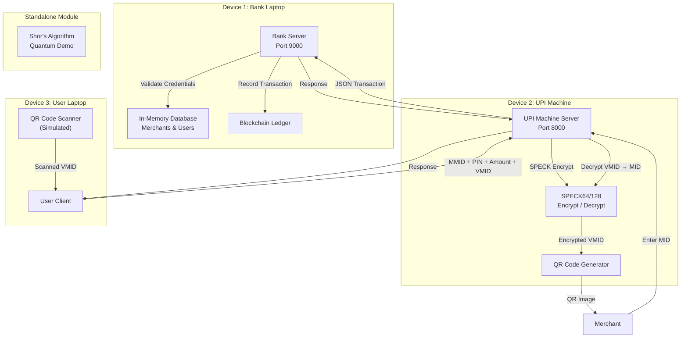
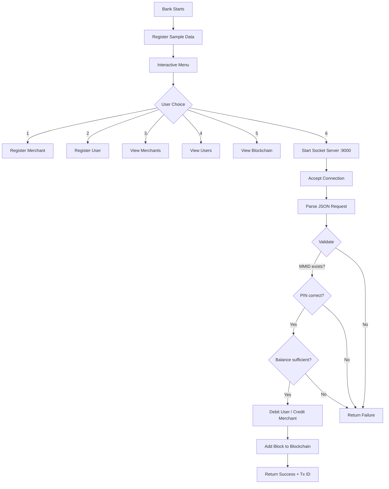
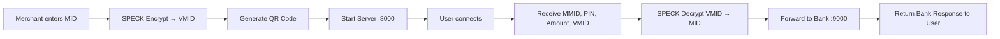
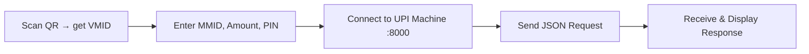
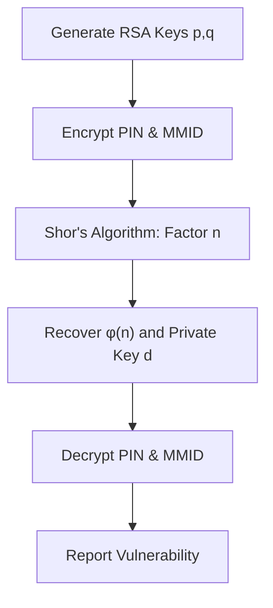
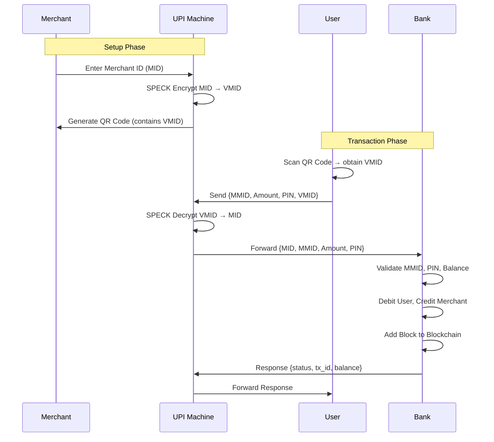

# Project Architecture — Centralized UPI Payment Gateway

## 1. High-Level System Architecture



---

## 2. Module Architecture

### 2.1 `crypto_utils.py` — Shared Cryptographic Core

| Component | Purpose |
|---|---|
| `generate_id()` | SHA-256 hash → truncated 16 hex digits (MID, UID, MMID) |
| `sha256_hash()` | Full SHA-256 digest for PIN/password hashing |
| `speck_encrypt()` | SPECK64/128 block encryption (27 rounds, 128-bit key) |
| `speck_decrypt()` | SPECK64/128 block decryption (reverse rounds) |
| `Block` class | Single blockchain block with hash-chaining |
| `Blockchain` class | Manages chain: genesis block, add transactions, validation |

### 2.2 `bank.py` — Bank Server



### 2.3 `upi_machine.py` — UPI Machine (Intermediary)



### 2.4 `user.py` — User Client



### 2.5 `shor_simulation.py` — Quantum Demo



---

## 3. Data Flow — Complete Transaction



---

## 4. Blockchain Structure

```
┌─────────────────┐    ┌─────────────────┐    ┌─────────────────┐
│  Genesis Block   │    │    Block #1      │    │    Block #2      │
│                  │    │                  │    │                  │
│ Tx ID: 00000000  │    │ Tx ID: a3f8b2c1  │    │ Tx ID: 7e2d91fa  │
│ Prev:  00000000  │◄───│ Prev:  <genesis> │◄───│ Prev:  <block1>  │
│ Hash:  d4e5f6... │    │ Hash:  9a8b7c... │    │ Hash:  1f2e3d... │
│ Time:  <init>    │    │ Time:  <ts1>     │    │ Time:  <ts2>     │
│ Data:  Genesis   │    │ Data:  {txn1}    │    │ Data:  {txn2}    │
└─────────────────┘    └─────────────────┘    └─────────────────┘
```

Each block hash = SHA-256(index + tx_id + previous_hash + timestamp + details)

---

## 5. Security Layers

| Layer | Algorithm | Purpose |
|---|---|---|
| ID Generation | SHA-256 | Unique, collision-resistant identifiers |
| QR Encryption | SPECK64/128 | Lightweight encryption of merchant data |
| PIN Storage | SHA-256 Hash | Passwords/PINs stored as hashes, never plaintext |
| Transaction Log | Blockchain | Immutable, tamper-evident record chain |
| Vulnerability Demo | Shor's Algorithm | Shows RSA weakness to quantum attacks |

---

## 6. Network Topology

| Component | Role | Port | Protocol |
|---|---|---|---|
| Bank Server | Central authority | 9000 | TCP |
| UPI Machine | Intermediary/gateway | 8000 | TCP |
| User Client | Initiates transactions | N/A (connects to 8000) | TCP |

All communication uses JSON-encoded messages over TCP sockets.
